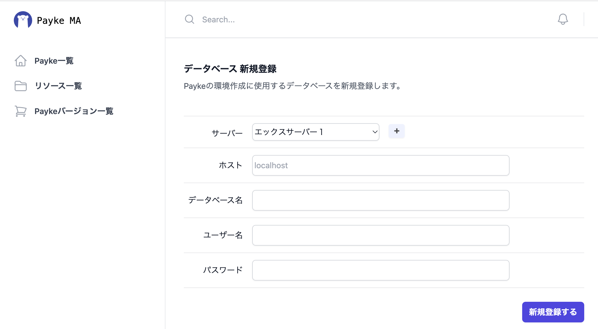
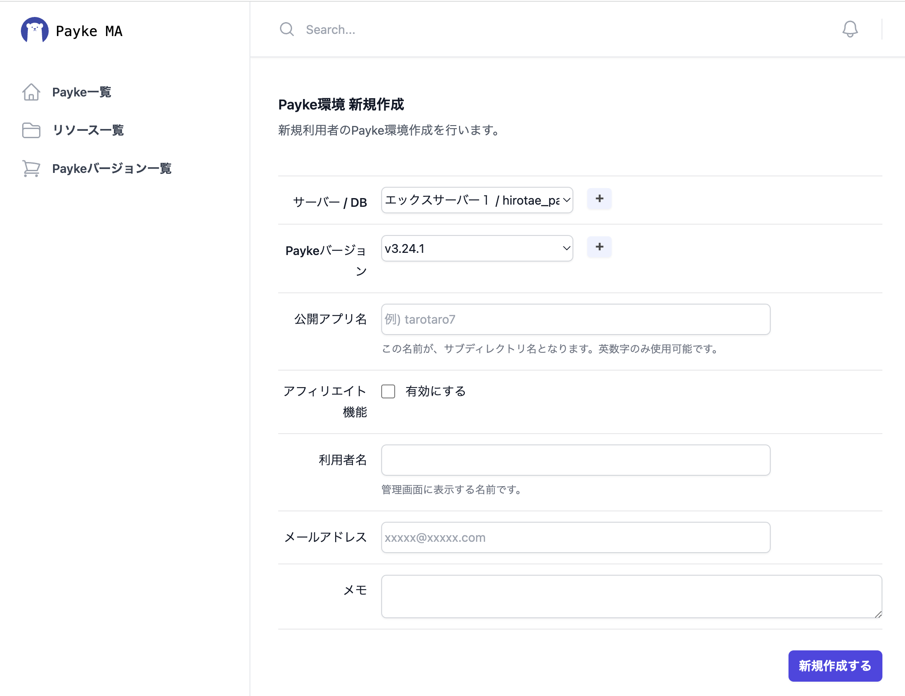
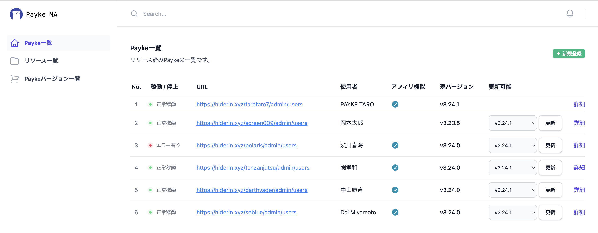

# Payke MAの使い方とシステム構成

## Payke MAとは？

Payke ECの一括管理ができるアプリです。  
Payke ECの新規環境構築や、バージョンアップをサポートします。

## Payke MAでできること

- Payke ECの新規環境構築
- 稼働中のPayke ECのバージョンアップ
- 稼働中のPayke ECのアフィリエイト機能のオンオフ

## Payke MA システム概要

前提として、Payke MAは、この４つの要素で作られています。

- サーバー　・・・　Payke ECをデプロイするのに使用するサーバーです。  
  （１つのサーバーで、複数のPaykeが稼働することを想定しています。）
- データベース　・・・　Payke ECで使用するデータベースです。
- Payke Zip　・・・　Payke ECのアプリがはいったZipファイルです。
- ユーザー　・・・　Payke ECの利用者です。


<br>

Payke MAでユーザー登録を行うと、  
指定したサーバー内に、そのユーザー用のPayke環境が作成されます。

環境ごとの.envファイルも、指定したデータベースの情報を元に自動で設置されます。

<br>

具体的には、その時のフォルダ構成は、このようになります。  
（環境構築の際に、「リソース管理フォルダ」「Payke公開フォルダ」「公開アプリ名」を  
　理解しておく必要があるので、細かめに説明します）

```
/home/userxxxx/paykexxx.com
├ payke_resources
│ ├ user_1_1
│ ├ user_1_2
│ └ user_1_3
│ 　 ├ current
│ 　 ├ shared
│ 　 └ releases
│ 　 　 ├ payke-ec_v3-17-9_20231130_163327
│ 　 　 ├ payke-ec_v3-21-7-1_20231130_182943
│ 　 　 ├ payke-ec_v3-23-4_20231211_114610
│ 　 　 ├ payke-ec_v3-23-5_20231205_173114
│ 　 　 └ payke-ec_v3-24-0_20231203_164900
└ public_html
　 └ screen009 -> /home/userxxxx/paykexxx.com/payke_resources/user_1_3/current
```

（↑は、サーバー情報を、  
　・「リソース管理フォルダ」：~/paykexxx.com/payke_resources  
　・「Payke公開フォルダ」　：~/paykexxx.com/public_html  
　で、登録した場合です。）

<br>

ポイントとして、

- 「リソース管理フォルダ（~/paykexxx.com/payke_resources）」に、  
ユーザーごとのフォルダが作られます。

- ユーザーごとのフォルダの中には、現在稼働しているPayke ECに加え、  
それ以前に使用していたバージョンのPayke ECを、７世代分保持するようになっています。

- そこで稼働しているPayke ECは、ユーザーごとに登録する「公開アプリ名」で、  
「Payke公開フォルダ（~/paykexxx.com/public_html）」へ公開されます。  
（今回の「user_1_3」の場合、「screen009」が「公開アプリ名」。）

<br>

とはいえ、これらは、  
サーバー情報の登録が完了すれば、それ以降、特に意識することなくご利用いただけます。

## Payke ECの新規環境構築の仕方

Payke ECの新規環境構築のためには、  
「サーバー」「データベース」「Payke Zip」「ユーザー」をそれぞれ登録する必要があります。

### 1. サーバーの登録方法

新規のPaykeを設置するサーバー（以下、リリース先サーバー）を、こちらの画面から登録します。


この画面は、サイドメニュー「リソース一覧」＞「＋サーバー」から開けます。

<br>

|項目|説明|
|----|----|
|サーバー名|リリース先サーバーの管理用の名前です。わかりやすければ、なんでもOKです。|
|ホスト名|リリース先サーバーへのssh接続時に使用するホスト名(or IPアドレス)です。|
|ユーザー名|リリース先サーバーへssh接続するときに使用するユーザー名です。|
|ポート番号|リリース先サーバーへssh接続するときに使用するポート番号です。|
|公開鍵|リリース先サーバーへssh接続するときに使用する公開鍵です。※１|
|リソース管理フォルダ|リリース先サーバーでの、ユーザーごとのフォルダが作られる場所を指定してください。|
|Payke公開フォルダ|リリース先サーバーのpublicなフォルダを指定してください。|
|||

### ２. データベースの登録方法

Payke ECで使用する、リリース先サーバーのデータベースを、こちらの画面から登録します。  
（データベース自体の作成は、別途おこなう必要があります。）

<br>



この画面は、サイドメニュー「リソース一覧」＞「＋データベース」から開けます。

<br>

|項目|説明|
|----|----|
|サーバー|リリース先サーバーを選択します。|
|ホスト|リリース先サーバーからのデータベース接続で使用するホスト名（or IPアドレス）です。|
|データベース名|使用するデータベース名です。|
|ユーザー名|データベース接続に使用するユーザー名です。|
|パスワード|データベース接続に使用するパスワードです。|
|||

### 3. Payke Zipの登録方法

Payke ECのリリースで使用するPayke ECのPHPソースの入ったZipファイルを、こちらの画面から登録します。

<br>


この画面は、サイドメニュー「Paykeバージョン一覧」から開けます。

<br>

|項目|説明|
|----|----|
|PaykeZipファイル|Payke ECのZipファイルをアップロードしてください。|
|||

<br>

Payke ECのバージョン表記（例えば、v3.24.1）の情報は、Zipファイルをアップロードすると、  
自動でなかのファイルを読みこんで、データベースに登録されます。

なので、とりあえずアップロードすれば、OKです。

<br>
<br>
<br>
<br>
<br>
<br>
<br>
<br>
<br>
<br>
<br>

### 4. ユーザーの登録方法

ユーザー登録（つまりは、Payke環境新規作成）は、こちらの画面から行えます。

<br>



この画面は、サイドメニュー「Payke一覧」＞「＋新規登録」から開けます。

<br>

|項目|説明|
|----|----|
|サーバー/DB|Payke ECのリリース先のサーバー/DBを選択してください。|
|Paykeバージョン|リリースするPayke ECのバージョンを選択してください。|
|公開アプリ名※|リリースしたPaykeECの公開アプリ名を入力してください。英数字のみ使用可能です。|
|アフィリエイト機能|Payke ECのアフィリエイト機能を有効にするかどうか選択してください。|
|利用者名|利用者名です。管理用なので、わかりやすければなんでもOKです。|
|メールアドレス|利用者のメールアドレスです。保守対応で必要になることを想定しています。|
|メモ|ご自由にお使いください。|
|||

※公開アプリ名についての補足説明

公開アプリ名は、リリースしたPayke ECへアクセスするための、URLで使用されます。

例えば、

・ホスト「paykeec.jp」のサーバーに、  
・公開アプリ名「tarotaro9」でユーザー登録すると、  

URLは「'https://paykeec.jp/tarotaro9'」になります。

<br>

ユーザーの登録が完了すると、こちらの「Payke一覧」の画面に追加されます。

<br>



以上が、Payke ECの新規環境構築の仕方でした。

次の章では、環境構築後のPayke ECのバージョンアップの方法について話していきます。

## 稼働中のPayke ECのバージョンアップ

稼働中のPayke ECのバージョンアップは、「Payke一覧画面」から行えます。

<br>


更新可能なPaykeECバージョンを選択して、  
その横の「更新」ボタンを押下すると、バージョンアップが開始されます。

<br>

バージョンアップの履歴は、こちらの画面から見ることができます。

<br>


この画面は、サイドメニュー「Payke一覧」＞ユーザーごとの「詳細」＞「アップデート履歴」から開けます。

アップデートに失敗した先には、エラーログを見れますので、  
成功したときに来るというよりは、失敗したときに来る画面になると思います。

## 稼働中のPayke ECのアフィリエイト機能のオンオフ

稼働中のPayke ECのアフィリエイト機能のオンオフは、こちらの画面から行うことができます。

<br>


この画面は、サイドメニュー「Payke一覧」＞ユーザーごとの「詳細」＞「編集画面」から開けます。

<br>

アフィリエイト機能の項目を、オンオフして登録すると、Payke ECの実環境へ反映されます。

<br>
<br>

以上です。ありがとうございました。

<style>
    h1, h2, h3, h4, h5, h6 {
        font-weight: bold;
    }
    h2 {
        text-decoration:underline;
    }
    h2, h3 {
        margin: 55px 5px 0px 5px;
    }
</style>